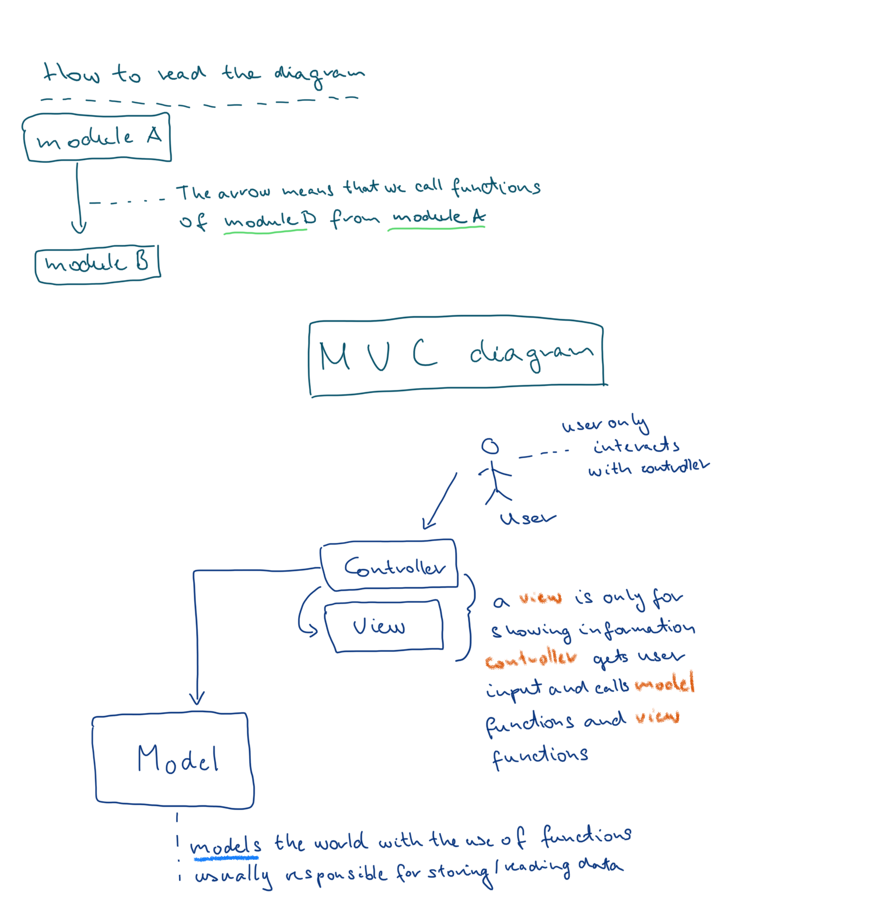

mvc-pattern-intro
## Software architecture and the Pyramids

To understand why we need to architect software it is best that we stop and think about how humans think about complex things. For instance how were the Pyramids built? What makes them stand?  
It is most definitely true that the Pyramids needed a lot of effort from a lot of people and also an overall vision towards the goal. The same goes for software.  
As with the bricks in the case of the Pyramid, programmers build applications on basic building blocks too: functions. Arriving from bricks to Pyramids is a long journey. Building an image viewer application from functions is also a lot of work.  
The undeniable fact is that we need to have an organizing principle to build a large program and MVC (Model View Controller) is such a principle!

## Organizing code

So when designing an application we *need* to organize the code. A strong idea is that we group functions of the same "kind". For example it is usually a good idea to group together functions describing how to interact with the *model* of the application.  
The *model* is a representation of the programmers ideas of the world by using programming language - I know it feels a bit hard to grasp, worry not, examples will come later.  
Let's say we are writing an image viewer application. This program can have for example the following features:

1. list images in a directory
2. change the file name
3. delete an image
4. add an image

Let's think about this application in terms of the MVC design.

### Thinking in MVC

Let's go through where the above features would go in an program which is organized according to MVC pattern.  
The operations themselves will be triggered by the user - let's call them user actions.  
User actions are handled in the *controller* part of the application.  
Whatever is shown on the screen will be put there by a *view* function.  
The *model* is responsible to actually change the file name, delete images, etc.  
How *model*, *view*, *controller* parts are related to each other?  
The *model* provides functions that are used by the *controller*.  
The *view* functions are responsible only for showing things on the screen.  
*Controller* functions are responsible for handling user input and calling *view* functions and *model* functions.

### Visualize MVC structure

The following diagram shows how we can think about software architecture with boxes and arrows and explains the basic ideas of the MVC design pattern

## Gimme proof this helps!

Let's go through some mind experiments in a question - answer format. Think about the described situation and then after pondering about it read the answer.

### **Question 1: Imagine a situation where you have a working version of the image viewer app but someone is not satisfied with how the images are shown in a list. Which part(s) of the system you should change in the Model View Controller structure?**

Let's go through this step-by-step.  
First you need to find the *view* function responsible for creating the list. As all view functions are organized under the view directory it will be easy enough to find it.  
Next step is to identify the part of the code which needs to be changed. Change the functionality and test the result. You should now test the how your view looks like. You can otherwise be assured that every other part of the application will work as before as changing a view function won't affect any other part of the application as views are only used to display content.

### **Question 2: Imagine a situation when you need to implement a feature to import photos from a smartphone. Which part(s) of the system you should change in the Model View Controller structure?**

First you need to understand what the import process will do:

1. select image to import
2. read image from the smartphone
3. add an image

This is a complex feature.  
We will need to add new *model* functions to read files from a smartphone.  
Also create *view* and *controller* for showing image selection menu and handling user input.  
The good news is that adding an image is ready to be used from the new controller as it is already implemented in the *model* for an old feature.

### **Question 3: Imagine a situation when a new programmer needs to start working on your project. How will you be able to explain to them how the application works by showing them the code**

Having an organization for the code helps to explain the application as you can talk using a language explaining the workings behind in rather succinct sentences which are precise as well.  
Building up a mental image of a codebase using proper *abstractions* is much easier than reading the code line-by-line and remembering everything (impossible).  
So to really show how the system is built go through step-by-step on a feature (e.g. import image from a smartphone) and show the newbie how the *view* is written and how user input handled in the *controller* and finally show how them how images are read from the smartphone and added to your collection in terms of *model* functions.

## Extra materials

Read and watch these only if you have a **lot** of time on your hands. Maybe skim through these or skip them entirely. Software architecture is a broad topic and is learnt in years not in days. (I told you :))

- [Why internal quality matters?](https://martinfowler.com/articles/is-quality-worth-cost.html#InternalQualityMakesItEasierToEnhanceSoftware)
- [Video about architecture (revisit in 5 years)](https://www.youtube.com/watch?v=DngAZyWMGR0)
- [Abstraction](https://levelup.gitconnected.com/what-is-abstraction-in-programming-2f35c8c72e15)
- [The origins of MVC pattern (advanced)](http://heim.ifi.uio.no/~trygver/themes/mvc/mvc-index.html)
